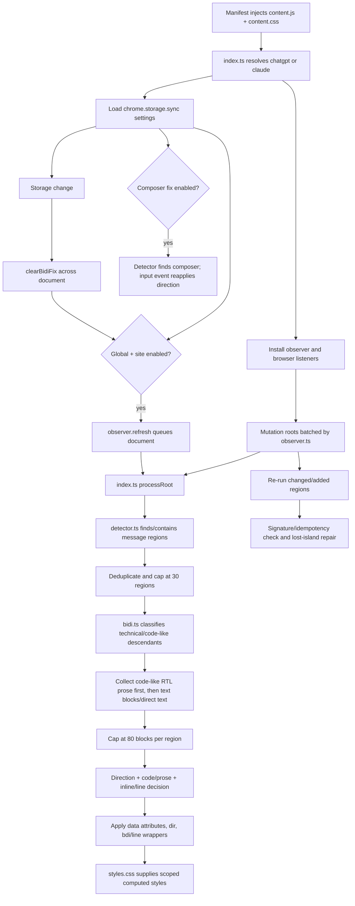

# BidiFix AI v0.2.0 Auto Engine architecture design

Status: proposed architecture, based on the v0.1.3 implementation at commit `4d328f2` on `feature/v0.2-architecture-design`.

This document separates **observed facts** about the current repository from **recommendations** for the incremental v0.2.0 foundation. It does not describe generic-web support as implemented. v0.1.3 remains the stable behavioral baseline.

## 1. Current architecture map

### 1.1 Module responsibilities (observed)

| File | Current responsibility |
| --- | --- |
| `manifest.json` | Manifest V3 package metadata. Declares only `storage`, statically injects the content script and CSS at `document_idle`, and limits host matches to ChatGPT and Claude origins. There is no background service worker or generic-site permission path. |
| `vite.config.ts` | Builds a self-contained classic `content.js`, the popup, content/popup CSS, public icons, and a copied manifest into `dist/`. |
| `src/shared/sites.ts` | Defines the closed `SupportedSite = 'chatgpt' \| 'claude'` union and maps the current hostname to one of those sites or `null`. |
| `src/shared/settings.ts` | Defines persisted settings, performance-safe defaults, and the `chrome.storage.sync` get/update/reset API used by the popup. |
| `src/content/index.ts` | Content-script controller. Identifies the site, loads settings, enables processing, dispatches detected message regions to `applyBidiFix`, optionally processes composers, installs input/storage/message listeners, and caps each refresh at 30 message regions. It duplicates the defaults and settings-key guard from `src/shared/settings.ts` to keep the emitted content script self-contained. |
| `src/content/detector.ts` | Contains ChatGPT selectors, Claude selectors/fallbacks, site exclusions, the shared text-block selector, message-region detection, containing-region lookup, and composer detection. Despite the exported name `findAssistantMessages`, ChatGPT detection intentionally includes displayed user messages. |
| `src/content/code-classifier.ts` | Pure, DOM-independent classifier for real code versus prose placed in code-like containers. It recognizes structured source, shell, JSON, HTML/XML, CSS, and config patterns while protecting Persian/Arabic prose and code containing Persian strings/comments. |
| `src/content/bidi.ts` | Combines text-direction detection, technical-content classification, block collection, ChatGPT/Claude exceptions, rendering decisions, DOM attributes, inline `<bdi>` isolation, experimental line wrappers, signatures, reconciliation repair, processing budgets, composer direction, and cleanup. |
| `src/content/observer.ts` | Observes the whole document subtree for added nodes and character-data changes, ignores mutations inside BidiFix-owned wrappers, batches roots for 120 ms, and flushes with `requestIdleCallback` (500 ms timeout) or `requestAnimationFrame`. |
| `src/content/styles.css` | Applies `direction`, `text-align`, and `unicode-bidi` only through BidiFix-owned data attributes. It includes technical/code, line-wrapper, composer, inline-island, and Claude-specific reinforcement rules. |
| `src/popup/popup.ts` | Reads and writes settings, renders toggle state, resets settings, and asks the active tab's content script for the current supported site. |
| `src/popup/popup.html` / `popup.css` | Presents global/per-site toggles plus Strong RTL, optional composer handling, optional experimental line wrapping, Debug Mode, reset, site status, and the local-processing privacy note. |
| `tests/code-classifier.test.mjs` | Pure regression matrix for RTL technical prose, genuine source/shell/JSON, Persian strings/comments, English technical prose, config-like labels, and inline code. |
| `tests/dom-fixture.ts` | Browser DOM/computed-style fixture for nested `pre > code > span`, a ChatGPT-like read-only CodeMirror container, processing-budget priority, LTR islands, code/prose transitions, reconciliation, idempotency, cleanup, and unchanged `textContent`. |
| `README.md`, `ROADMAP.md`, `docs/*.md`, `PRIVACY.md` | Describe current behavior, release QA, privacy constraints, and the future auto-engine direction. They are not runtime inputs. |

### 1.2 Current control and data flow (observed)



Detailed startup behavior:

1. Chrome injects only on the four declared ChatGPT/Claude match patterns.
2. `getCurrentSite()` returns a fixed site ID. If it returns `null`, the content controller does not start.
3. `index.ts` marks the document element with BidiFix load/site data, creates the observer, and registers listeners before the asynchronous settings read completes.
4. Loaded settings trigger a full-document refresh only when both global and current-site settings are enabled.
5. A refresh or observed mutation produces one or more candidate roots. `detector.ts` returns matching conversation regions plus a containing region for nested mutation roots.
6. `index.ts` deduplicates regions and processes at most 30 per refresh.
7. `applyBidiFix()` first marks technical elements and classifies `pre`, `code`, and font-mono elements. RTL prose in these containers is deliberately prioritized before ordinary blocks so it is not starved by the 80-block budget.
8. For each block, the current code derives readable text, computes a lightweight signature, chooses a direction, and decides whether inline isolation or the opt-in line-level path is allowed.
9. Rendering uses `dir`, BidiFix data attributes, scoped CSS, and—only where allowed—`<bdi dir="ltr">` or experimental line spans. It does not insert Unicode bidi control characters.
10. On reconciliation, unchanged signatures are skipped unless an RTL block has lost required inline LTR islands. This repairs ChatGPT/CodeMirror child replacement without rescanning every stable block.
11. A relevant settings change calls `clearBidiFix()` and then performs a new refresh if enabled. Cleanup unwraps BidiFix wrappers and restores the original `dir` stored on each managed element.
12. Composer detection and mutation are inactive unless `composerDirectionFix` is true. Experimental line-level wrapping is inactive unless `experimentalMixedPromptFix` is true.

### 1.3 Current site coupling (observed)

Site knowledge is distributed rather than isolated:

- `src/shared/sites.ts` is a closed two-site registry.
- `manifest.json` statically limits injection to those sites.
- `src/content/index.ts` branches per site for enablement and passes the site into rendering.
- `src/content/detector.ts` contains both ChatGPT and Claude selectors, exclusions, fallbacks, message rules, and composer rules.
- `src/content/bidi.ts` has ChatGPT displayed-user-message logic and Claude-specific block-collection branches.
- `src/content/styles.css` contains a Claude-only scope.
- `src/popup/popup.ts` and popup markup know the two site IDs and render two dedicated toggles.
- `Settings` contains `chatgptEnabled` and `claudeEnabled` as first-class fields.

The pure code classifier is already independent of this coupling. Direction detection is logically pure but currently resides inside the DOM renderer.

## 2. Current architectural risks

### 2.1 Mixed responsibilities (observed risk)

`src/content/bidi.ts` is the main change-risk concentration. A classifier tweak, selector change, DOM-wrapping change, budget change, or cleanup change can affect the same execution path. It currently owns all of the following:

- pure character/direction analysis;
- code/prose integration;
- DOM text extraction and block discovery;
- site-specific exceptions;
- confidence-like policy decisions without an explicit confidence contract;
- DOM mutation and CSS marker assignment;
- reconciliation signatures;
- cleanup and original-state restoration;
- optional composer behavior; and
- optional high-risk line segmentation.

`src/content/detector.ts` also mixes structural detection with content policy. Claude candidates must already contain RTL text, while ChatGPT candidates need only non-empty text. The renderer then imports `TEXT_BLOCK_SELECTOR` from the detector, so detection and rendering depend on each other's implementation details.

### 2.2 Generic-web blockers (observed risk)

- Injection is impossible outside current origins because host matches are static.
- `SupportedSite` cannot represent an adapter ID plus a generic mode.
- Detection assumes conversation/message regions, a `main` landmark, and ChatGPT/Claude-specific markup.
- Claude detection searches broad `div`/`span` candidates but filters using site-specific RTL and exclusion logic; these rules are not safe generic-page rules.
- Block selection includes site-class fallbacks such as `whitespace-pre-wrap` and Claude prose classes.
- Popup enablement is modeled as two Boolean site fields, not access grants plus per-origin preferences.
- CSS assumes BidiFix message containers and includes a Claude-specific override.

### 2.3 Regression-sensitive behavior (observed contract)

The following behavior exists because earlier broader fixes caused real regressions and must not be casually generalized:

- default `composerDirectionFix`, `experimentalMixedPromptFix`, `strongRtl`, and `debug` are false;
- default mode creates no line wrappers and does not touch active editors;
- ChatGPT displayed user prompts avoid inline isolation unless experimental mode is enabled;
- inline isolation is limited to blocks of at most 2,000 characters;
- experimental line processing is limited to 4,000 characters and 80 generated line wrappers per message region;
- code-like RTL prose is processed before ordinary blocks within the 80-block cap;
- each refresh is capped at 30 message regions;
- real code remains LTR even when strings or comments contain Persian/Arabic;
- reconciliation restores missing LTR islands when text is unchanged;
- all CSS overrides remain scoped to BidiFix data attributes; and
- no Unicode control characters or text rewriting are used.

### 2.4 Performance and lifecycle risks (observed)

- The observer watches the entire document subtree. It batches work, but pending roots are not reduced to a minimal ancestor set, so overlapping additions can cause repeated region detection.
- Full-document refresh is intentionally available for startup and settings changes; applying the same approach to generic sites would be too broad without stronger candidate filtering and budgets.
- `directReadableText()` clones a block subtree to remove technical descendants. This is bounded today but can become expensive on arbitrary article DOM.
- The current text signature uses length plus the first and last 40 characters. It is cheap, but different middle content can collide.
- State is stored in page-visible data attributes. This enables inspection and cleanup, but page reconciliation can preserve some markers while replacing managed children.
- The observer ignores mutations inside current wrapper types, but new renderer-owned node types would need to be added or they could trigger feedback loops.
- `BidiObserver.disconnect()` exists but the controller never needs to call it during the normal content-script lifetime.

### 2.5 Idempotency, cleanup, and editor risks (observed)

- Cleanup depends on querying known attributes and wrapper types. Any future marker must be included in cleanup before it is shipped.
- `clearBidiFix(root)` queries descendants; a future scoped caller must account for the case where `root` itself is managed.
- The original `dir` is captured once in `data-ai-bidi-original-dir`. If the page legitimately changes `dir` while BidiFix owns the element, restoration policy becomes ambiguous.
- Nested `pre`/`code` nodes may both receive managed state. The current DOM fixture protects this behavior, so extraction must retain ordering and idempotency.
- Inline `<bdi>` and experimental spans mutate framework-owned DOM. The current limits and user-message exclusions are safety controls, not merely tuning constants.
- Composer direction directly mutates editor DOM. It is correctly off by default and must remain a separately authorized advanced feature.

### 2.6 Browser/settings risks (observed)

- Defaults and `isSettingsKey()` are duplicated between `src/content/index.ts` and `src/shared/settings.ts`, which can drift.
- The observer and listeners are installed before storage settings load. A DOM mutation during that short window is evaluated using enabled defaults, even if the stored setting is disabled.
- Storage changes cause global cleanup before reprocessing. This is simple and safe for two sites but could be expensive on large generic pages.
- The popup talks directly to Chrome APIs and raw persisted settings. A future permission model would add access-state logic unless a browser/settings boundary is introduced first.

## 3. Target v0.2.0 boundaries (recommended)

The target should remain a small set of functions and interfaces, not a framework. Existing public functions can remain as compatibility facades while their internals move behind these boundaries.

| Boundary | Owns | Must not own |
| --- | --- | --- |
| **Bidi Core** | Pure character/direction analysis, mixed-text facts, real-code classification, inline LTR range detection, confidence calculation, and a render recommendation. | DOM selectors, `HTMLElement`, Chrome APIs, site IDs, storage, CSS classes, or mutation scheduling. |
| **Rendering Engine** | DOM text extraction, safe application of a decision, original-state capture, BidiFix markers, wrappers, budgets, signatures, reconciliation repair, idempotency, and cleanup. | ChatGPT/Claude selectors, hostname checks, permission requests, persisted settings, or independent text heuristics. |
| **Generic Web Detector** | Conservative discovery of readable regions/blocks and structural safety metadata on an already-authorized page. Excludes controls, navigation, hidden content, editors, and ambiguous containers. | Permission acquisition, bidi direction decisions, inline token classification, or site-specific selectors. |
| **Site Adapters** | Host matching, optimized region/block selectors, role hints, site-specific exclusions, composer discovery, and priority hints for complex sites. | Bidi classification or direct DOM mutation. ChatGPT and Claude remain optimized adapters. |
| **Browser Layer** | Content-script startup, Chrome storage/messages, access state, future permission operations, detector/adapter selection, observer lifecycle, processing budgets at page/refresh level, and debug logging. | Text heuristics and direct rendering details. |
| **Settings boundary** | One canonical defaults object, schema/version migration, persistence, access preferences, and a runtime settings snapshot. | Popup DOM or page DOM. |
| **Popup boundary** | Render a view model, send user intent, show current-page/access state, and reveal advanced settings. | Direct detector selection, bidi decisions, or assumptions that a tab is supported merely because a message responds. |

Recommended dependency direction:

```text
popup -> browser/settings
content controller -> adapter registry or generic detector
detectors/adapters -> detection contracts
content controller -> Bidi Core -> render decision
content controller -> Rendering Engine
Rendering Engine -> DOM/CSS markers only
Bidi Core -> no browser or DOM dependency
```

## 4. Proposed TypeScript contracts

These contracts are intentionally small. They describe data already implicit in v0.1.3 and leave scoring internals replaceable.

### 4.1 Core analysis and decision

```ts
export type TextDirection = 'rtl' | 'ltr' | 'auto';
export type Confidence = 'low' | 'medium' | 'high';
export type ContentKind = 'prose' | 'code' | 'technical' | 'unknown';

export interface InlineTextRange {
  start: number;
  end: number;
  direction: 'ltr';
  kind: 'url' | 'path' | 'command' | 'identifier' | 'phrase';
}

export interface TextAnalysis {
  direction: TextDirection;
  contentKind: ContentKind;
  hasRtl: boolean;
  hasLtr: boolean;
  mixed: boolean;
  confidence: Confidence;
  inlineRanges: readonly InlineTextRange[];
  reasons: readonly string[];
}

export type RenderMode = 'none' | 'minimal' | 'full';

export interface RenderDecision {
  mode: RenderMode;
  direction: TextDirection;
  align: 'left' | 'right' | 'start';
  bidi: 'plaintext' | 'isolate' | 'normal';
  isolateInlineLtr: boolean;
  technical: boolean;
  confidence: Confidence;
  reason: string;
}
```

`reasons` are short enum-like diagnostic labels, not copied page text. High confidence may permit the current full block fix and bounded inline isolation. Medium confidence should produce only reversible block-level metadata. Low confidence must map to `mode: 'none'`.

The initial compatibility policy should reproduce current behavior exactly; the presence of a confidence field must not itself change v0.1.3 decisions.

### 4.2 Detection contracts

```ts
export type RegionRole = 'assistant' | 'user' | 'article' | 'unknown';
export type CandidateHint = 'prose' | 'code-like' | 'technical' | 'unknown';

export interface DetectedRegion {
  root: HTMLElement;
  role: RegionRole;
  source: 'adapter' | 'generic';
  sourceId: string;
  priority: number;
}

export interface BlockCandidate {
  element: HTMLElement;
  region: DetectedRegion;
  hint: CandidateHint;
  editable: boolean;
  structurallySafe: boolean;
  priority: number;
}

export interface ContentDetector {
  findRegions(root: ParentNode): readonly DetectedRegion[];
  findContainingRegion(element: Element): DetectedRegion | null;
  findBlocks(region: DetectedRegion): readonly BlockCandidate[];
}
```

Detection confidence and text confidence should remain distinct. `structurallySafe: false` always prevents rendering even if the text analysis is high confidence.

### 4.3 Site adapter contract

```ts
export interface SiteAdapter extends ContentDetector {
  readonly id: string;
  matches(location: Pick<Location, 'hostname' | 'pathname'>): boolean;
  findComposers(root: ParentNode): readonly HTMLElement[];
  findContainingComposer(element: Element): HTMLElement | null;
}
```

Adapters may use selectors and site knowledge to emit candidates and roles. They must not call the Bidi Core or mutate candidate DOM. A registry chooses the first matching optimized adapter; generic detection is a separate fallback only when access and settings allow it.

### 4.4 Rendering, budgets, and reconciliation

```ts
export interface RenderBudget {
  remainingRegions: number;
  remainingBlocks: number;
  remainingInlineCharacters: number;
  remainingLineWrappers: number;
}

export interface AppliedState {
  version: string;
  textSignature: string;
  decisionKey: string;
  originalDir: string | null;
  generatedNodeCount: number;
}

export interface RenderOutcome {
  status: 'applied' | 'unchanged' | 'repaired' | 'skipped';
  generatedNodeCount: number;
  reason: string;
}

export interface RenderingEngine {
  apply(
    candidate: BlockCandidate,
    decision: RenderDecision,
    budget: RenderBudget,
  ): RenderOutcome;
  needsReconciliation(
    candidate: BlockCandidate,
    decision: RenderDecision,
  ): boolean;
  cleanup(root: ParentNode): void;
  isOwnedNode(node: Node): boolean;
}
```

The implementation may continue to use data attributes rather than an object-oriented renderer or central state map. The contract matters: application, repair, ownership detection, and cleanup must agree on the same marker/version scheme. `AppliedState` stores metadata only; it must not retain page text.

### 4.5 Settings and popup view model

Do not replace the persisted `Settings` shape in the first phase. Introduce a boundary before adding access modes:

```ts
export interface SettingsStore<T> {
  get(): Promise<T>;
  update(patch: Partial<T>): Promise<T>;
  reset(): Promise<T>;
  subscribe(listener: (settings: T) => void): () => void;
}

export interface PageAccessView {
  siteLabel: string;
  detector: 'chatgpt' | 'claude' | 'generic' | 'none';
  access: 'granted' | 'not-granted' | 'not-applicable';
  enabled: boolean;
}
```

The popup should eventually consume `PageAccessView` plus a settings snapshot. It should not infer permission state from content-script reachability alone.

## 5. Incremental migration plan (recommended)

Each phase should be independently reviewable and revertible. Compatibility facades should keep current imports stable until the relevant migration is complete.

### Phase 1 — Extract pure direction facts without behavior change

**Purpose:** create the first Bidi Core seam while leaving rendering, detection, settings, selectors, marker names, budgets, and popup behavior untouched.

**Existing files affected:**

- `src/content/bidi.ts`
- `package.json` test glob/script only if needed to run the added unit file

**Justified new files:**

- `src/core/text-direction.ts`
- `tests/text-direction.test.mjs`

Move the existing `TextDirection`, RTL/LTR character expressions, `detectDirection()`, `hasRtlText()`, and `hasLtrText()` into a DOM-free module. Preserve the exact algorithms, including the current `strongRtl` behavior. Re-export `detectDirection` from `bidi.ts` temporarily if any current import or test relies on it.

**Tests and acceptance:**

- direct parity tests for empty, Persian-only, Arabic-only, English-only, mixed, numeric/punctuation-only, and `strongRtl` cases;
- existing classifier tests pass unchanged;
- all nine DOM fixture checks pass unchanged;
- typecheck, lint, and production build pass;
- built behavior retains the same data attributes, CSS states, wrapper counts, and default settings;
- manual ChatGPT/Claude smoke tests show no visible difference.

**Rollback/compatibility:** one new pure import can be reverted without a data or DOM migration. No persisted setting or page marker changes.

### Phase 2 — Complete the pure Bidi Core inputs

**Existing files affected:**

- `src/content/bidi.ts`
- `src/content/code-classifier.ts` (retain as a compatibility re-export initially)
- `tests/code-classifier.test.mjs`

**Justified new files:**

- `src/core/code-classifier.ts`
- `src/core/inline-ltr.ts`
- `tests/inline-ltr.test.mjs`

Move the current pure classifier into `src/core` and extract the existing inline-regex matching into a pure `findInlineLtrRanges(text)` function. Keep DOM walking/wrapping in `bidi.ts`. Preserve the current matching expression and ordering before adding token kinds.

**Tests and acceptance:** classifier matrix stays byte-for-byte equivalent at the API boundary; inline range tests cover URLs, paths, commands, phrases, punctuation, Persian adjacency, and no-match cases; DOM fixture text and island counts remain unchanged.

**Rollback/compatibility:** keep old module exports until all imports migrate; no stored state changes.

### Phase 3 — Introduce explicit analysis/decision types in compatibility mode

**Existing files affected:**

- `src/content/bidi.ts`
- `src/core/text-direction.ts`
- `src/core/code-classifier.ts`
- relevant pure tests

**Justified new files:**

- `src/core/types.ts`
- `src/core/analyze-text.ts`
- `src/core/decide-rendering.ts`
- `tests/render-decision.test.mjs`

Create `TextAnalysis` and `RenderDecision`, but implement a v0.1.3 compatibility policy first. Do not activate new confidence thresholds yet.

**Tests and acceptance:** a golden matrix maps current prose/code/composer samples to the same direction, technical flag, inline-isolation permission, and no-op behavior; DOM fixture and manual supported-site results remain unchanged.

**Rollback/compatibility:** `applyBidiFix()` remains the external entry point and may adapt the new decision back to existing internal variables.

### Phase 4 — Extract the Rendering Engine

**Existing files affected:**

- `src/content/bidi.ts`
- `src/content/observer.ts`
- `tests/dom-fixture.ts`

**Justified new files:**

- `src/content/rendering/renderer.ts`
- `src/content/rendering/dom-state.ts`
- `src/content/rendering/budgets.ts`

Move managed-direction capture/restore, markers, signatures, inline wrapping, line wrapping, reconciliation, and cleanup behind rendering functions. Keep selector order, code-like priority, current signature, marker names, CSS, and numerical budgets unchanged in the first extraction.

**Tests and acceptance:** computed styles, unchanged `textContent`, nested code behavior, code/prose transitions, island repair, idempotency, cleanup, owned-mutation filtering, and zero default line/composer markers all pass. Add a scoped-cleanup case where the supplied root is itself managed.

**Rollback/compatibility:** retain `applyBidiFix()`, `applyComposerFix()`, and `clearBidiFix()` as facades until the controller migration is complete.

### Phase 5 — Split ChatGPT and Claude adapters

**Existing files affected:**

- `src/content/detector.ts`
- `src/content/bidi.ts` (remove site branches only after adapter metadata replaces them)
- `src/content/index.ts`
- `src/shared/sites.ts`

**Justified new files:**

- `src/content/detection/types.ts`
- `src/content/adapters/chatgpt.ts`
- `src/content/adapters/claude.ts`
- `src/content/adapters/registry.ts`
- focused detector fixture tests

Move selectors, exclusions, roles, composer discovery, and priority hints into adapters. Keep `detector.ts` as a compatibility facade during migration. Replace the ChatGPT user-prompt exception and Claude block branches with candidate metadata rather than renderer site checks. Preserve the existing Claude document marker and CSS scope during this phase.

**Tests and acceptance:** for representative fixtures, region/block sets, order, roles, exclusions, and containing-region behavior match v0.1.3; current live ChatGPT and Claude manual QA passes; no generic detector is selected.

**Rollback/compatibility:** adapter registry supports only current site IDs initially; `SupportedSite` and stored per-site Booleans remain valid.

### Phase 6 — Consolidate browser controller and settings lifecycle

**Existing files affected:**

- `src/content/index.ts`
- `src/content/observer.ts`
- `src/shared/settings.ts`
- `src/popup/popup.ts`

**Justified new files:**

- `src/browser/settings-store.ts`
- `src/content/controller.ts`

Create one canonical settings/defaults implementation usable by popup and content build output. Start processing only after the initial settings snapshot is known. Reduce overlapping observer roots where tests prove equivalence; retain 120 ms batching and idle scheduling until separately benchmarked.

**Tests and acceptance:** stored-disabled startup causes no transient processing, storage updates still clean and reapply correctly, debug remains silent by default, popup/reset behavior is unchanged, and long-chat budgets/performance remain at least as good as v0.1.3.

**Rollback/compatibility:** preserve the stored key names and defaults; no settings migration is required in this phase.

### Phase 7 — Add the Generic Web Detector in fixture/shadow mode

**Existing files affected:**

- `src/content/detection/types.ts`

Production constraint: no manifest, permission, controller, registry, or popup integration until the detector is proven in isolation.

**Justified new files:**

- `src/content/detection/generic-web.ts`
- `tests/generic-detector-fixture.ts` and fixture HTML

Implement conservative readable-block discovery and structural exclusions. Initially run it only in direct tests or a development-only shadow harness that records counts when Debug Mode is explicitly enabled; it must not mutate ordinary websites or ship with broader host access.

**Tests and acceptance:** fixtures cover articles, tables, nested prose, navigation, buttons, dialogs, hidden content, form controls, contenteditable/ProseMirror, code, and very large pages; low-confidence/unsafe candidates are excluded; bounded traversal meets an agreed fixture budget; ChatGPT/Claude still use adapters and have identical rendering output.

**Rollback/compatibility:** the registry has no production generic fallback until a later explicit activation phase.

### Phase 8 — Activate confidence policy and simplify normal UX

**Existing files affected:**

- `src/core/analyze-text.ts`
- `src/core/decide-rendering.ts`
- content controller/registry
- `src/shared/settings.ts`
- `src/popup/*`
- README, privacy, QA, and store documentation as behavior changes

Apply high/medium/low decisions: full safe fix, minimal reversible block fix, or no change. Keep a compatibility policy for ChatGPT/Claude until the new auto policy passes the full baseline matrix. Move existing technical toggles into an Advanced section without removing their persisted meanings.

**Tests and acceptance:** confidence boundary tables, false-positive fixtures, current supported-site golden cases, generic fixtures, copy/paste, selection, editor safety, cleanup, reconciliation, and performance all pass. Low-confidence candidates produce zero BidiFix DOM changes.

**Rollback/compatibility:** use an internal policy switch during rollout; current-site adapters can fall back to the compatibility policy without reverting stored settings.

### Phase 9 — Optional host access (separate reviewed feature)

This phase begins only after generic detection is proven. It requires manifest, browser-layer, popup, privacy, and store-review work and is intentionally outside the first implementation task.

**Tests and acceptance:** see the permission strategy below. Release must prove there is no silent broad grant, no processing without a grant plus enablement, and reliable disable/revoke behavior.

## 6. Regression contract

The following contract applies to every migration phase unless an intentional behavior change is separately designed, tested, documented, and approved.

### Content integrity

- Never insert Unicode bidi control characters.
- Never rewrite user-visible text characters.
- Any generated `<bdi>` or span must preserve the exact concatenated `textContent` and must be removable.
- Selection and copy/paste into a plain-text editor must preserve original text and ordering.

### Safe defaults

- Global, ChatGPT, and Claude support remain enabled by default.
- Strong RTL, Composer direction fix, Experimental mixed prompt fix, and Debug Mode remain disabled by default.
- Default mode creates no `data-bidifix-line` wrappers and no `data-bidifix-composer` markers.
- Active `textarea`, `input`, contenteditable, role=textbox, and framework editor DOM remain untouched unless the user enables the composer feature.

### Classification and rendering

- The current code/prose matrix remains stable, including Persian technical prose in code-like containers and genuine code with Persian strings/comments.
- Real technical/code content remains LTR/left/isolate.
- RTL prose remains RTL/right/plaintext, with bounded LTR islands where currently allowed.
- ChatGPT displayed user-prompt restrictions and Claude reinforcement remain effective until equivalent adapter metadata is verified.
- BidiFix CSS stays scoped to extension-owned markers.

### Idempotency, cleanup, and reconciliation

- Reprocessing unchanged DOM does not add nested or duplicate wrappers.
- Prose-to-code and code-to-prose transitions clear stale markers and wrappers.
- Renderer-owned mutations do not create observer feedback loops.
- If a site renderer replaces children but preserves a managed container, required state is repaired.
- Disabling the extension or a site removes generated wrappers/attributes and restores original `dir` values where possible.
- Cleanup and ownership detection must evolve together for every new marker or generated node.

### Streaming and budgets

- Added nodes and character-data updates continue to be processed during streaming.
- Batching/idle scheduling remains in place.
- Current caps—30 regions per refresh, 80 blocks per region, 2,000 characters for inline isolation, 4,000 characters for line processing, and 80 line wrappers—remain compatibility defaults until benchmark-backed replacements are approved.
- Code-like RTL prose remains priority work and cannot be starved by ordinary prose candidates.
- Generic detection must introduce tighter page-level traversal/candidate budgets before production activation.

## 7. Permission strategy (design only)

### Current fact

v0.1.3 has only the `storage` permission and static content-script matches for ChatGPT and Claude. There is no `optional_host_permissions`, `<all_urls>`, background service worker, `scripting` permission, or runtime grant flow.

### Recommended future model

Treat permission state and feature enablement as separate conditions:

```text
may process page = host access granted AND BidiFix enabled for that origin/mode
```

Possible user-initiated modes:

1. **Enable on this site** — request only the current origin pattern, then register/inject the generic content script for that origin.
2. **Enable on selected sites** — maintain an explicit list of origins chosen individually by the user; each origin still requires a browser grant.
3. **Enable on all websites** — request broad HTTP/HTTPS host access only from a clear user gesture with an explanation of local text inspection. Do not silently request it during installation or upgrade.

A later MV3 implementation will likely need optional host patterns, a browser action/popup user gesture, `chrome.permissions.request`, and a service-worker/`chrome.scripting` path for dynamic registration or injection. Exact manifest additions must be validated in a separate implementation design; none are proposed for the current branch.

Design requirements:

- Keep current ChatGPT/Claude static access initially so the stable experience does not regress while generic access is experimental.
- The Chrome permission grant is authoritative. A synced preference must never be treated as a grant on another device.
- Store only origin-level preferences needed for the feature; never store page text, titles, prompts, responses, or browsing history.
- Clearly show granted, enabled, denied, and unsupported states in the popup.
- Before revoking access, attempt cleanup in currently reachable tabs; explain that a reload may be needed if Chrome revokes access before cleanup completes.
- Removing a selected site must unregister future injection and disable processing on already-open tabs where messaging is still available.
- Privacy policy, Chrome Web Store disclosures, reviewer instructions, and manual QA must be updated before any broader-access release.
- Generic detection must remain disabled on browser/internal pages and any scheme not explicitly supported.

## 8. Explicit non-goals for the first implementation phase

Phase 1 will not:

- implement the confidence model in runtime decisions;
- change direction or code/prose heuristics;
- move or modify ChatGPT/Claude selectors;
- add a Generic Web Detector or process unsupported websites;
- add or change host permissions, `<all_urls>`, manifest entries, background code, or content-script registration;
- change persisted settings, defaults, popup layout, or site toggles;
- change CSS, BidiFix data attributes, signatures, wrappers, cleanup, reconciliation, observer scheduling, or processing budgets;
- alter composer/editor behavior;
- refactor the full `bidi.ts` module in one change; or
- bump a version, tag, publish, or release.

The smallest safe first implementation is only the extraction and direct testing of the existing pure direction primitives. That creates a real dependency boundary with a narrow rollback surface before any confidence, detector, renderer, or permission work begins.
